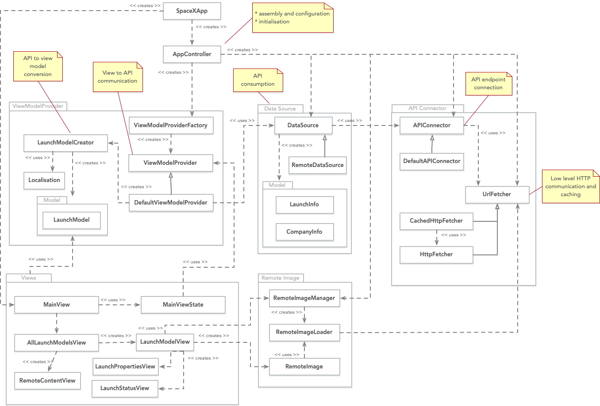

# SpaceX 
The project was developed using Xcode 12.5

## Architecture

## Well Known Issues
* "pull down to refresh" - Used explicit refresh button because this feature is not supported natively in SwiftUI yet
* when the app started with no network connectivity then, on some occassions, the refresh button is not enabled when network connectivity returned